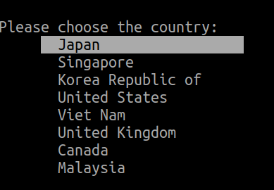
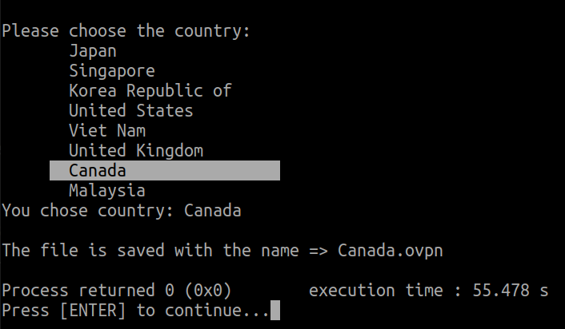
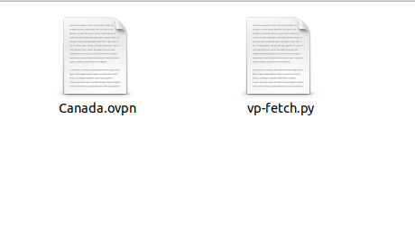

# VP-FETCH

Simple python script to fetch the config file of the free vpn servers provided by VPNgate.

## Use
```python

python3 vp-fetch

```

select the country from the list and press enter.



<country_name>.ovpn file will be save in current working dir. In my case I select Canada.



file in the folder



To connect to the vpn server use the command

```sh

sudo openvpn Canada.ovpn

```
## System

- Ubuntu 20.04
- python 3.7.9 and 3.8.5


## Requirements
- #### required python libraries

  - bullet
  - pandas
  - bs4
  - requests
- openvpn client
